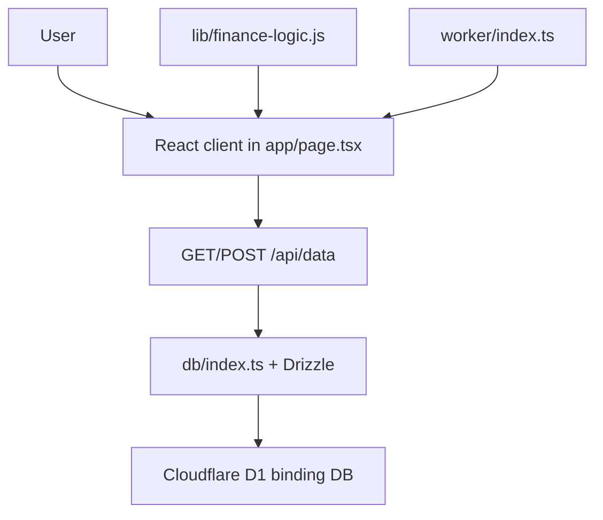

# Architecture

## Snapshot identity

This document describes the current Sites implementation represented by
commit `9904d25`, including the P0 financial-correctness and second-round audit
guards. The public repository is an independent audit copy. It is not wired to
push changes back to the production Site.

## Runtime shape

### Frontend

- Framework surface: React 19 with the Next-compatible App Router API, built by
  Vinext and Vite for the Cloudflare runtime.
- Entry page: `app/page.tsx`.
- Document metadata/layout: `app/layout.tsx`.
- Styles: `app/globals.css`.
- Pure financial and portfolio guard logic: `lib/finance-logic.js`.
- Component structure: the current version intentionally keeps the product
  views and small reusable UI helpers in one client component module. There is
  no `src/components/` directory in this snapshot.
- State management: React `useState` and `useEffect` only. There is no Redux,
  Zustand, React Query, or browser persistence layer.
- Routing: a client-side `View` union and `setView` state drive the dashboard,
  research, memory, portfolio, valuation, industry, compare, and journal
  screens. There are no URL route files for these views.

Main view functions in `app/page.tsx` include:

- `Dashboard`
- `ResearchView`, `CompanyList`, `CompanyDetail`, `QueueView`, `ScreenerView`
- `MemoryView`
- `PortfolioView`
- `ValuationView`
- `IndustryView`
- `CompareView`
- `JournalView`
- `Composer` for company, task, event, journal, transaction, and industry forms

## Backend

- API route: `app/api/data/route.ts`.
- `GET /api/data` initializes the schema if necessary, then reads all current
  entity tables into one `AppData` payload.
- `POST /api/data` dispatches on an `action` string and performs inserts,
  updates, deletes, transaction validation, provenance writes, and valuation
  upserts.
- Data access: `db/index.ts` exposes `getDb()` using `drizzle-orm/d1` and the
  Cloudflare Worker `env.DB` binding.
- Worker entry: `worker/index.ts` delegates requests to Vinext and handles the
  image optimization path.

`app/chatgpt-auth.ts` contains reusable ChatGPT identity helpers, but the
current page and data API do not import them. Production privacy is therefore
provided by the Sites access policy (currently Owner-only), not by per-row
application authorization.

## Database

The database is Cloudflare D1 (SQLite-compatible). Drizzle definitions are in
`db/schema.ts`; the runtime bootstrap, additive compatibility checks, currency
backfills, and demo seed path are in `db/index.ts`; the generated migration
history is in `drizzle/`; the review mirror is `database/schema.sql`.

The current schema does not declare SQL foreign-key constraints. Relationships
are represented by integer ID columns and respected by application code. This
is documented explicitly in `docs/DATABASE.md`.

## Deployment

`vite.config.ts` imports `.openai/hosting.json`, declares the D1 binding for
local development, loads Vinext, and enables the Cloudflare Vite plugin.
ChatGPT Sites builds the source with `npm run build`, then runs the
Worker-backed artifact with the `DB` binding. The public copy redacts the Site
project identifier in `.openai/hosting.json`; details and the production
non-modification boundary are in `docs/DEPLOYMENT.md`.
